# uOttawa - 2024-2025 - Projet

**Nom du projet** : Système de gestion de commandes de PC personnalisés

## Membres du projet

| Prénom |  Nom  |       Identifiant GitHub       |
|--------|-------|--------------------------------|
| Nicola | Baker | https://github.com/NicolaBaker |

## Introduction

Ce projet a pour but de créer une application qui facilite la gestion de commandes de PC personnalisés. L'application permet à plusieurs rôles d'interagir : **Administrateur**, **StoreKeeper**, **Assembler**, et **Requester**. Chaque rôle a des fonctionnalités pour garantir une gestion fluide des utilisateurs, du stock et des commandes, avec une authentification et une interface simple à utiliser.

##### Vidéo de l'application final : https://uottawa-my.sharepoint.com/personal/nbake013_uottawa_ca/_layouts/15/guestaccess.aspx?share=EY_8uhI2lIRIvExtw6GYLm0BJROYejZ2cpvIljB9534hRQ&nav=eyJyZWZlcnJhbEluZm8iOnsicmVmZXJyYWxBcHAiOiJPbmVEcml2ZUZvckJ1c2luZXNzIiwicmVmZXJyYWxBcHBQbGF0Zm9ybSI6IldlYiIsInJlZmVycmFsTW9kZSI6InZpZXciLCJyZWZlcnJhbFZpZXciOiJNeUZpbGVzTGlua0NvcHkifX0&e=7ls6Qo 
---

## Clarifications sur les exigences

### Exigences explicites reformulées
1. Chaque utilisateur doit se connecter avec un rôle spécifique.
2. Les administrateurs peuvent ajouter, modifier ou supprimer des utilisateurs.
3. Les gestionnaires de stock peuvent ajouter et gérer des composants matériels et logiciels.
4. Les assembleurs gèrent les commandes, les acceptent ou les rejettent.
5. Les demandeurs peuvent créer des commandes et suivre leur statut.
6. La base de données Firebase est utilisée pour l’authentification et la gestion des données.

### Exigences implicites proposées
1. Les informations doivent être mises à jour en temps réel avec Firebase.
2. Les champs de saisie doivent être vérifiés pour éviter les erreurs.
3. Les notifications visuelles (toasts) sont utilisées pour confirmer les actions.

### Hypothèses
1. Tous les utilisateurs sont autorisés par l’administrateur.
2. Une connexion Internet est nécessaire pour accéder aux fonctionnalités.
3. Les rôles sont bien définis et immuables une fois attribués.
---

## Modélisation

### Diagramme de classes
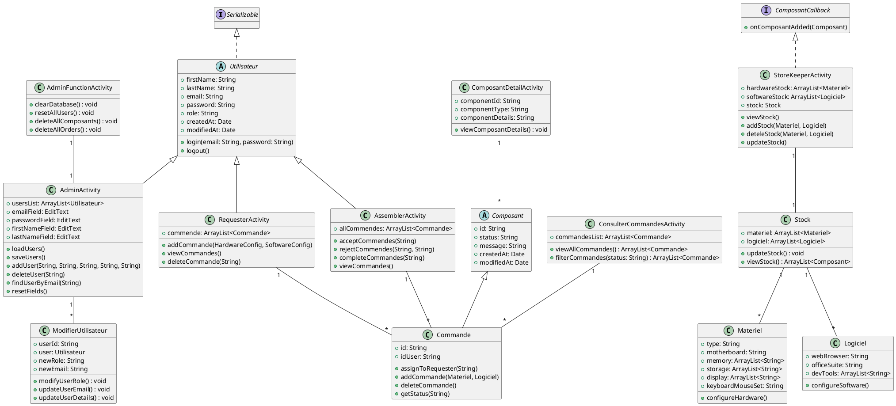

### Diagrammes d'utilisation
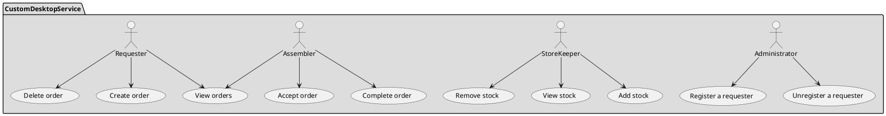
### Diagrammes d'activités

#### Accueil et authentification
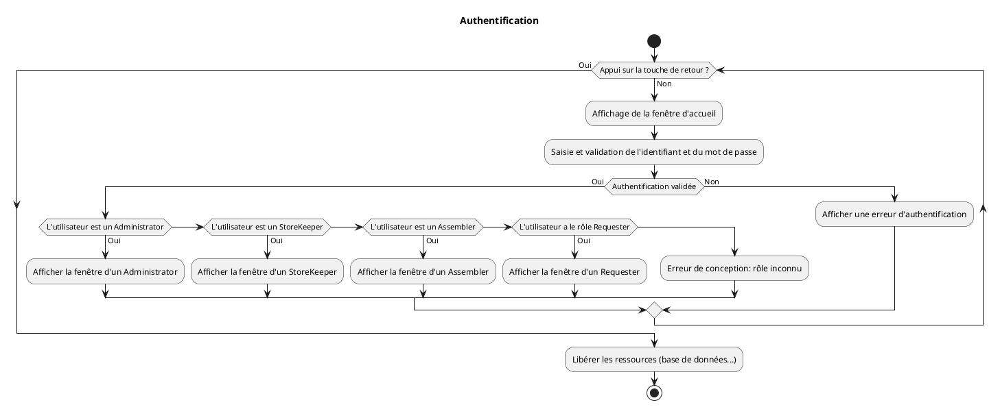
#### Gestion des utilisateurs
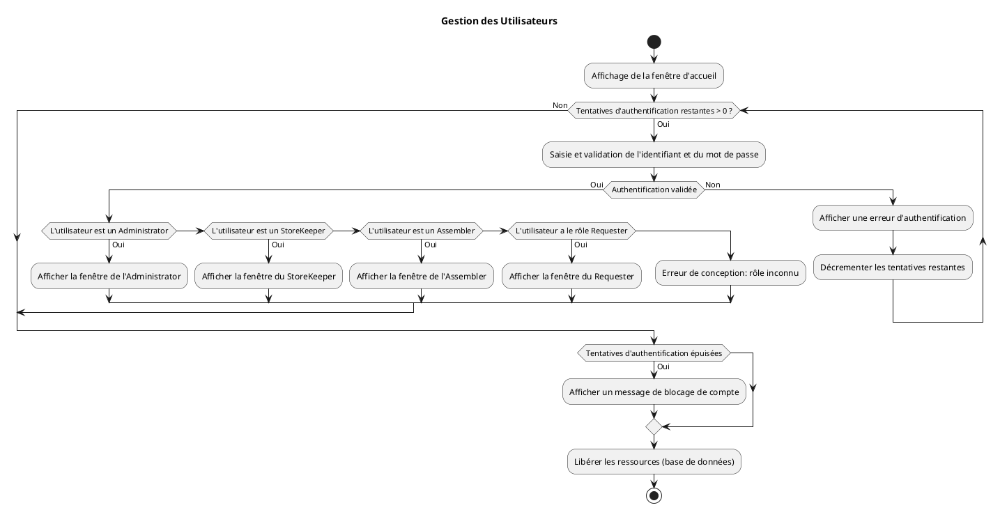

#### Gestion du stock
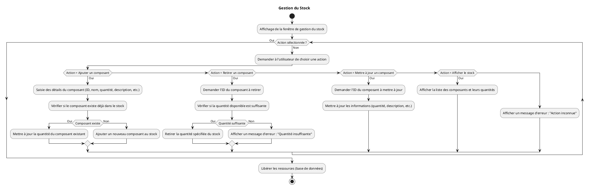

#### Passage d'une commande
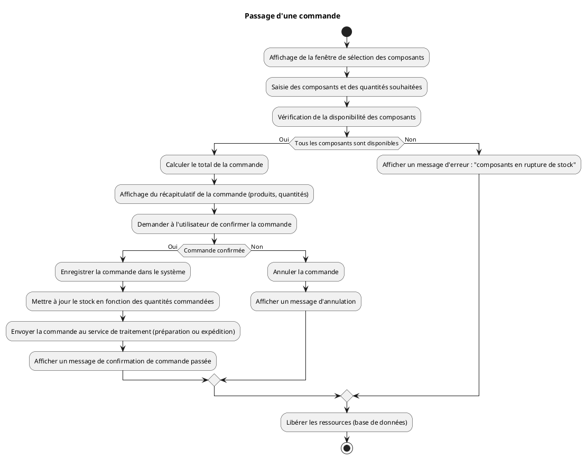

#### Traitement d'une commande
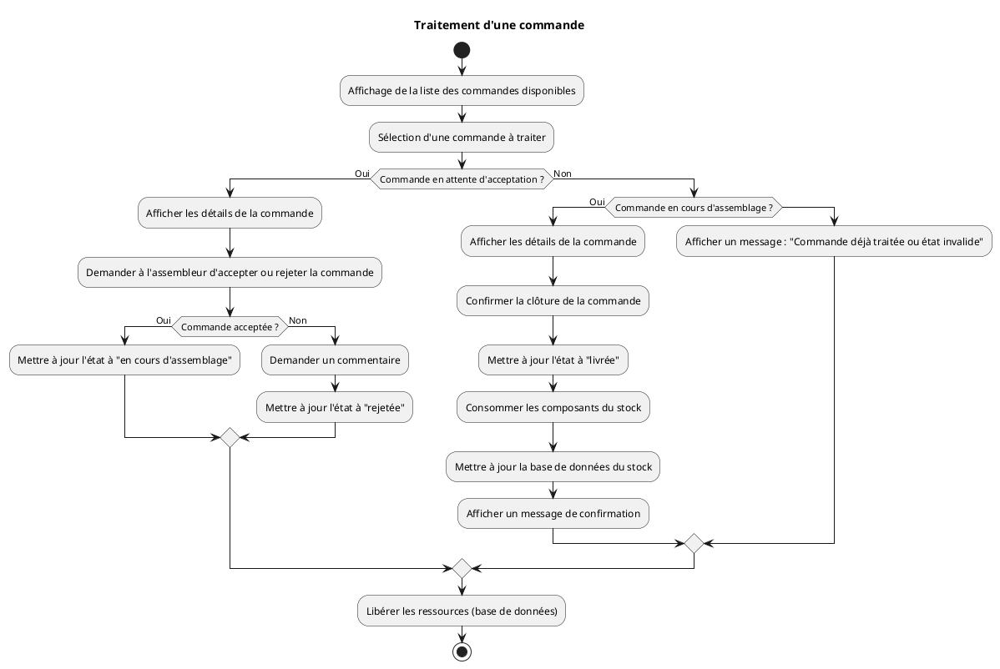

### Diagrammes de séquences

#### Pour l'accueil et l'authentification
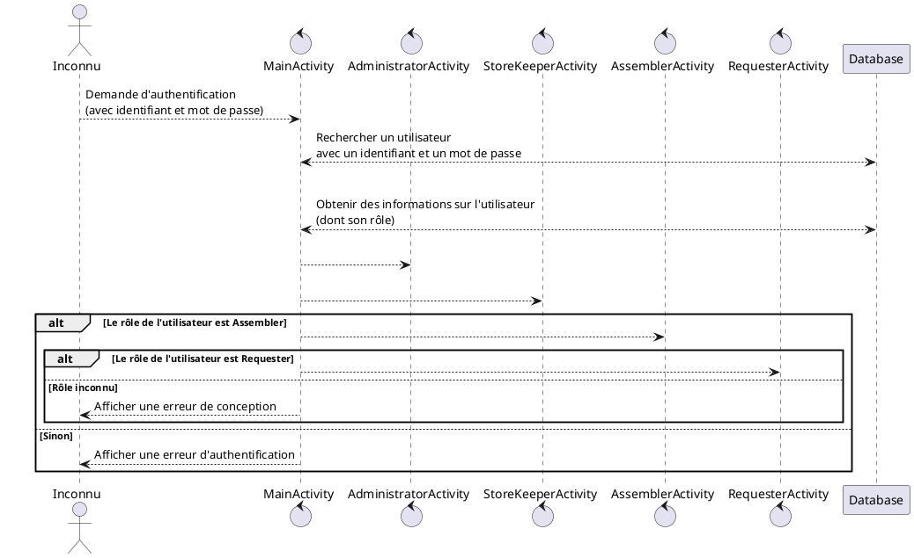
#### Pour le rôle Administrator
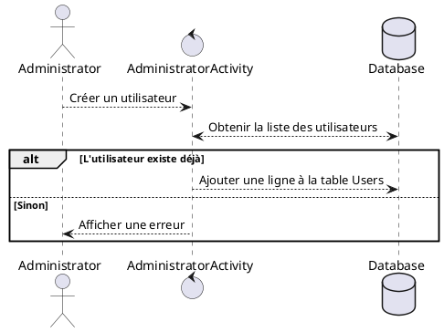
#### Pour le rôle StoreKeeper
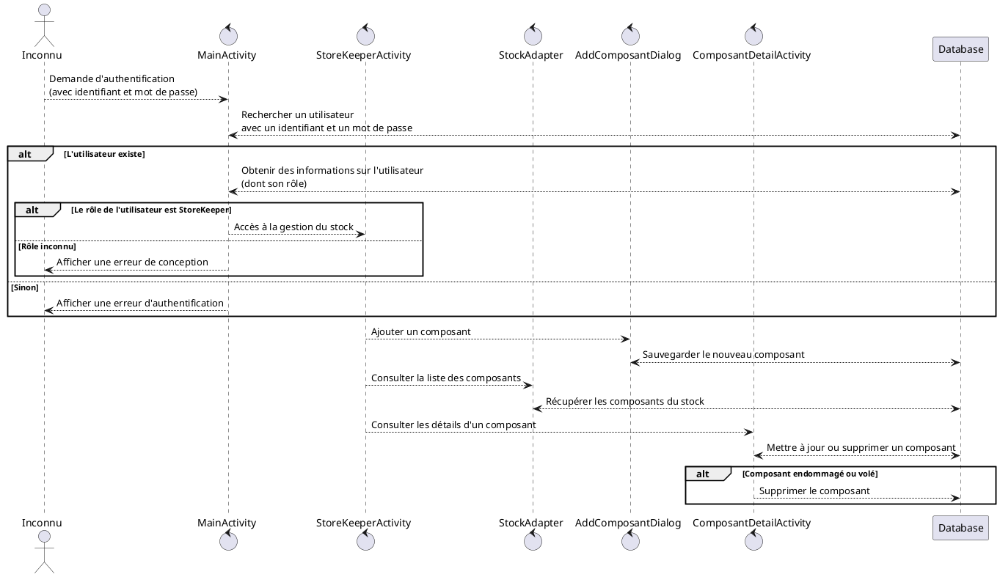
#### Pour le rôle Assembler
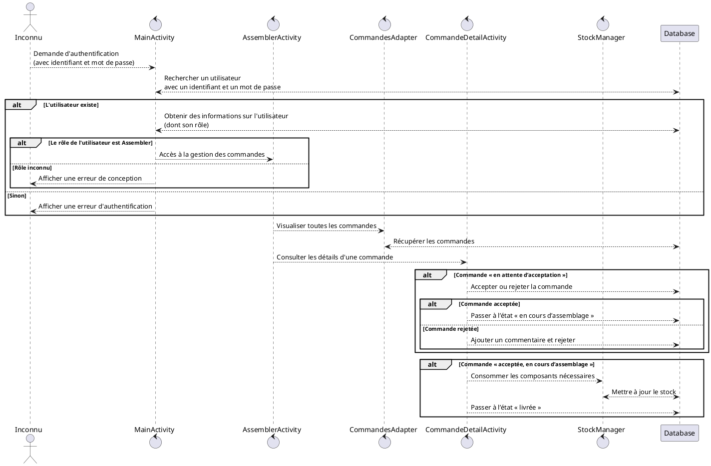
#### Pour les commandes
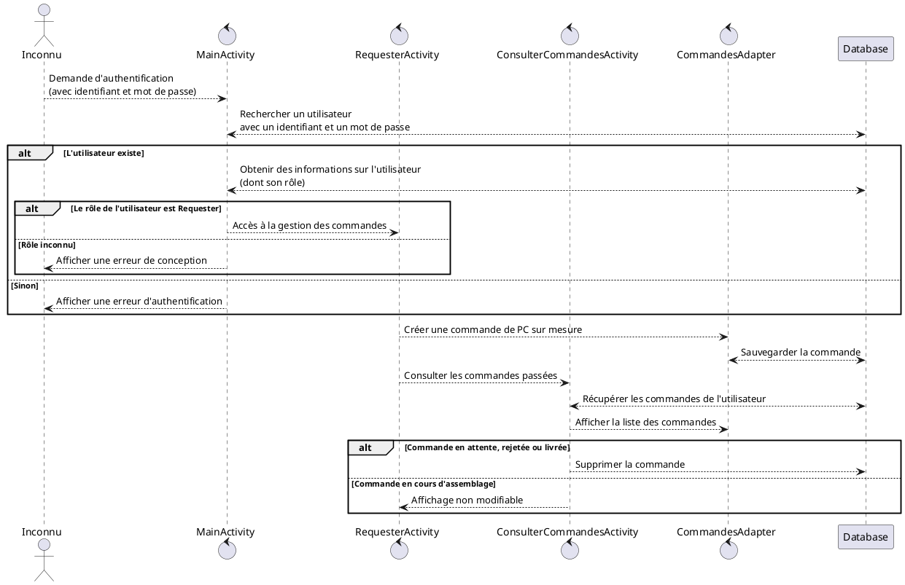
### Diagrammes de état

#### Pour les commandes
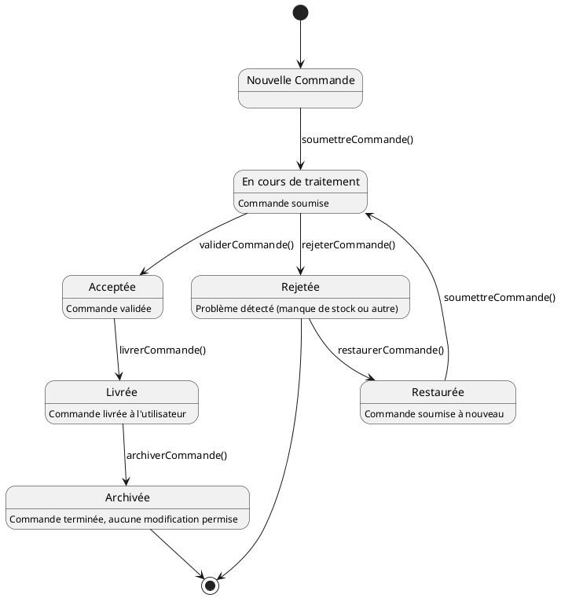
## Eléments de conception

Les éléments de conception incluent toutes les classes et fonctions nécessaires au fonctionnement de l'application. Les classes principales comme Utilisateur et Composant et Commande servent de base, tandis que des classes spécifiques comme AdminActivity, StoreKeeperActivity, RequesterActivity et AssemblerActivity ajoutent des fonctions adaptées à chaque rôle. Des activités comme ComposantDetailActivity et ConsulterCommandesActivity permettent de consulter ou gérer les détails des composants et des commandes. Chaque élément joue un rôle pour assurer que l'application soit fluide et réponde aux besoins des utilisateurs.

## Eléments de tests unitaires

Tous les tests unitaires ont passé avec succès. Cela signifie que toutes les fonctionnalités testées, comme les getters, setters et la mise à jour des données, fonctionnent correctement. Aucun problème n’a été trouvé lors de l'exécution des tests, et toutes les valeurs sont bien mises à jour comme prévu. Les tests ont également vérifié les valeurs par défaut pour les objets créés avec le constructeur sans paramètres. En résumé, tout est opérationnel et stable, sans erreur.
Outils Utilisés : JUnit
Comment Lancer les Tests :  test → "Run" pour exécuter les tests

### Espresso : 
Outil pour tester l'interface utilisateur Android de manière automatisée.
Tous les tests, y compris ceux d'interface utilisateur avec Espresso, ont été tester.

## Comment installer et utiliser la solution

Pour utiliser la solution téléchargez le projet, ouvrez-le dans Android Studio, configurez Firebase, puis lancez l’application sur un appareil ou un émulateur. Connectez-vous pour accéder aux fonctionnalités comme la gestion des stocks et des commandes.

## Eléments de démonstration

### Scénario ("storyboard") suggéré

Un demandeur peut créer une nouvelle commande en sélectionnant des composants matériels et logiciels, puis soumettre la commande. L'assembleur voit les commandes en attente, les accepte et met à jour leur statut une fois terminées. L'administrateur peut gérer les utilisateurs, modifier leurs informations ou supprimer des comptes si nécessaire. Le responsable du stock vérifie les quantités disponibles et ajoute ou retire des composants selon les besoins.

### Valeurs de test

#### Utilisateurs

| Rôle           | Identifiant de connexion | Mot de passe |
|----------------|--------------------------|--------------|
| Administrateur |      admin@baker.ca      |    Anicola   |
| StoreKeeper    |   storekeeper@baker.ca   |    Snicola   |
| Assembler      |    assembler@baker.ca    |    Asnicola  |
| Requester      |    r@baker.ca            |    nicola    |

#### Fichier de données exemple

Localisation : data/stock.json
Format : JSON contenant des informations sur le stock, les utilisateurs et les commandes.

## Limites et problèmes connus

L'interface pourrait être améliorée avec plus d'animations et un design plus moderne.

## Information destinées aux correcteurs

#### APK : PCSurMesure.apk
#### Identifiants de connexion : Voir la section des valeurs de test.
---

# Checklist pour le Projet livrable 3

## Notation de base
- [X] Chaque membre a effectué au moins 1 commit.

---

## Modèle Conceptuel UML
- [X] Le modèle conceptuel est fourni (Word, PDF, Markdown, Opuml, Visual Paradigm, etc.).
- [X] Il inclut au minimum un diagramme de classe UML :
  - [X] Comporte les principaux concepts du projet.
  - [X] Comporte au moins 10 attributs et 10 méthodes.
  - [X] Respecte le formalisme UML.
 

### Bonus :
- [X] +5 si le modèle comporte un diagramme d’activité.
- [ ] +5 si le modèle comporte un diagramme de séquence.
- [ ] +5 si le modèle comporte un diagramme d’états.

---

## Projet Android Studio
- [X] Le projet Android Studio est soumis avec l'APK de démonstration, le fichier README et le tag correspondant au livrable.

---

## Fonctionnalités de Gestion de Commandes
- [X] Les fonctions de gestion de commande (ajout, suppression, visualisation) sont en place et fonctionnelles.

---

## Tests Unitaires Automatisés (API)
- [X] Des tests unitaires automatisés (au moins 10) de niveau API sont en place pour valider la gestion des commandes.

---

## Validation des Champs
- [X] Tous les champs sont validés (valeurs saisies vérifiées, messages d'erreur appropriés en cas de saisie incorrecte).

---

## Bonus CircleCI
- [ ] La construction de l’application et les tests automatiques sont automatisés au moyen de CircleCI.

---

## Tests d’Interface Utilisateur (Espresso)
- [X] Des tests d’interface utilisateur basés sur Espresso sont en place.

---

## Organisation du Projet
- [X] Le projet est "propre" (bien organisé, facilement reconstructible, sans fichiers superflus et sans artefacts de reconstruction).

---

## Fichier README
- [X] Le projet contient un fichier README "riche" (avec beaucoup d'informations utiles) et bien présenté.

# Checklist pour le Projet Livrable 4

## Notation de base  
- [X] Chaque membre a effectué au moins 1 commit.  

---

## Modèle Conceptuel UML  
- [X] Le modèle conceptuel est fourni (Word, PDF, Markdown, Opuml, Visual Paradigm, etc.).  
- [X] Il inclut au minimum un diagramme de classe UML :  
    - [X] Comporte les principaux concepts du projet.  
    - [X] Comporte au moins 10 attributs et 10 méthodes.  
    - [X] Respecte le formalisme UML.
    - [X] le modèle comporte un diagramme d’activité.
    - [X] le modèle comporte un diagramme de séquence.  
    - [X] le modèle comporte un diagramme d’états.  

---

## Projet Android Studio  
- [X] Le projet Android Studio est soumis avec l'APK de démonstration, le fichier README et le tag correspondant au livrable.  

---

## Fonctionnalités de Gestion d'Assemblage
- [X] Les fonctions d’assemblage sont en place et fonctionnelles :  
  - [X] Consultation des commandes en attente.  
  - [X] Validation des commandes selon le stock disponible.  
  - [X] Mise en attente des commandes avec stock insuffisant.  
  - [X] Rejet des commandes avec raison justifiée.
  - [X] Approbation des commandes et simulation de livraison.  

---

## Tests Unitaires Automatisés (API)  
- [X] Des tests unitaires automatisés (au moins 10) de niveau API sont en place pour valider la gestion des commandes.

---

## Validation des Champs
- [X] Tous les champs sont validés (valeurs saisies vérifiées, messages d'erreur appropriés en cas de saisie incorrecte).

---

## Rapport Final
- [X] Le rapport final est complet et contient :
  - [X] Une référence au dépôt GitHub.
  - [X] Une description des choix de conception.
  - [X] Une section sur les exigences supplémentaires (proposées, traitées ou écartées).  
  - [X] Un retour d’expérience détaillé.
  - [X] Un tableau de synthèse des contributions.
  - [X] Une estimation du temps global passé sur chaque livrable.  

---

## Organisation du Projet
- [] Le projet est "propre" (bien organisé, facilement reconstructible, sans fichiers superflus et sans artefacts de reconstruction).  

---

## Fichier README  
- [X] Le projet contient un fichier README "riche" (avec beaucoup d'informations utiles) et bien présenté.  
